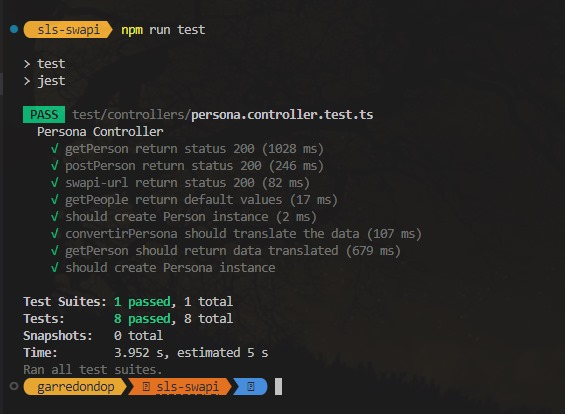

# SWAPI serverless

## Comandos para iniciar el proyecto

```
npm install
```

## Compilar el proyecto

```
npm run build
```

## Compilar el proyecto en modo observador

```
npm run build:dev
```

## Ejecución en desarrollo de manera local

```
npm run start:dev
```

## Compilación y ejecución en desarrollo de manera local

```
npm run dev
```

## Desplegar en producción:
```
npm run start
```

# Métodos expuestos

## GET: Lista traducida de personas

```
/personas
```

[personas](https://tyvsupnv1b.execute-api.sa-east-1.amazonaws.com/personas)


 ```json
{
  [
    {
        "id": "4a5b19ff-18e0-4b0f-890b-510fd000fc3c",
        "nombre": "Luke Skywalker",
        "genero": "masculino",
        "origen": "Tatooine",
        "peliculas": [
            "A New Hope",
            "The Empire Strikes Back",
            "Return of the Jedi",
            "Revenge of the Sith",
            "The Force Awakens"
        ],
        "especies": [
            "Human"
        ],
        "vehiculos": [
            "Snowspeeder",
            "Imperial Speeder Bike"
        ],
        "navesEspaciales": [
            "X-wing",
            "Imperial shuttle"
        ]
    },
    ...
  ]
}
``` 

## POST: Adiciona una persona al listado

```
/personas
```

#### Deployed:
 [personas](https://tyvsupnv1b.execute-api.sa-east-1.amazonaws.com/personas).

Copy and paste the following JSON object into the request body:
```json
{
        "nombre": "Pepito Skywalker",
        "genero": "masculino",
        "origen": "Tatooine",
        "peliculas": [
            "A New Hope",
            "The Empire Strikes Back",
            "Return of the Jedi",
            "Revenge of the Sith",
            "The Force Awakens"
        ],
        "especies": [
            "Human"
        ],
        "vehiculos": [
            "Snowspeeder",
            "Imperial Speeder Bike"
        ],
        "navesEspaciales": [
            "X-wing",
            "Imperial shuttle"
        ]
}
```
 
# Testing

```
npm run test
```


# Gracias!!
